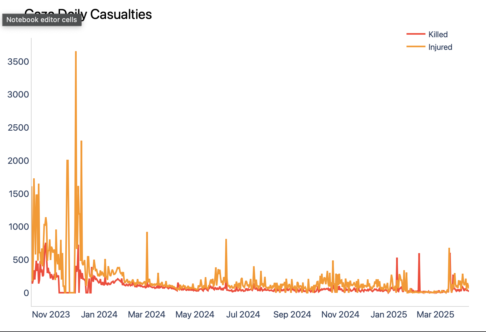
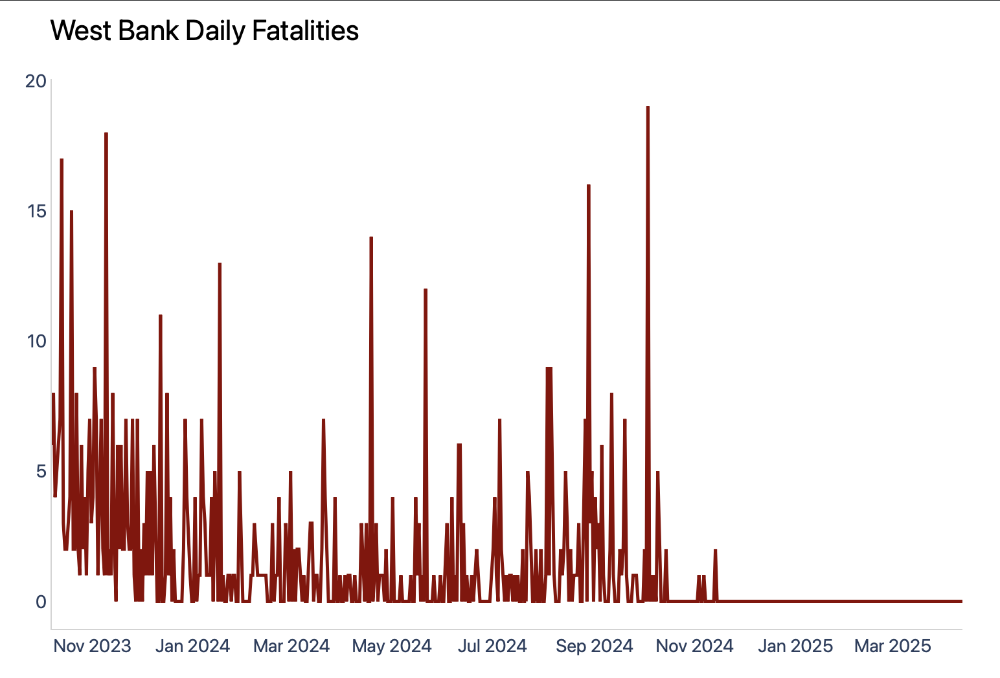
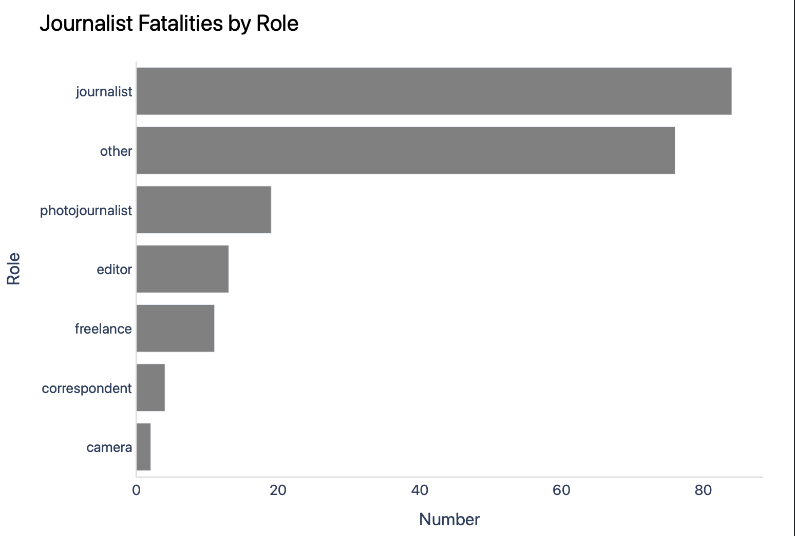
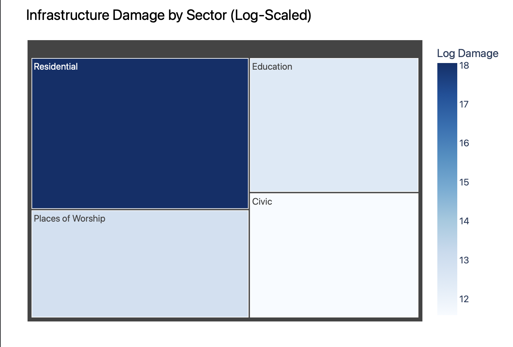

# Humanitarian Impact Assessment: Gaza and West Bank

This project analyses the humanitarian impact of the Gaza and West Bank conflict (Oct 2023 – Mar 2025), focusing on casualties, journalist fatalities, and infrastructure damage.

---

## Author  
**Mohammad Rashid Abdullah**  
Junior Data Analyst | April 2025

**Tools Used**: Python (Pandas, Plotly), Excel, Kaggle Notebooks

---

## Key Findings

- Gaza reported consistently higher daily casualties than the West Bank.
- Journalist fatalities spiked during conflict escalation phases.
- Infrastructure damage was most severe in Gaza, affecting schools, hospitals, and homes.

---

## Visual Overview

| Chart | Description |
|-------|-------------|
|  | Daily deaths and injuries in Gaza |
|  | Daily deaths in the West Bank |
|  | Timeline of press fatalities |
|  | Sectoral damage overview |

> All charts generated using Plotly in Kaggle.

---

## Access the Project

- [View Full Report (Google Docs)](https://docs.google.com/document/d/1IGT-WzfGr6jiww22y2jUbVrPnBPyAoEB41NOseGY9Pl/edit?usp=sharing)  
- [Run on Kaggle Notebook](https://www.kaggle.com/code/rasyidbejay/humanitarian-impact-gaza-westbank-visualisation)

---

## License

Shared for educational and awareness purposes.

